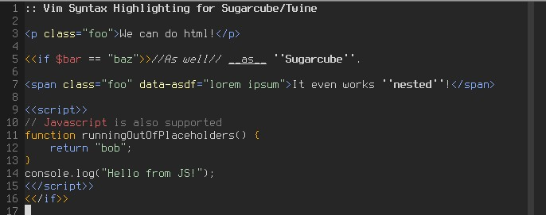

# twine-sugarcube.vim – vim syntax for Twine+Sugarcube

A relatively simple syntax highlighter for vim, based on [thricedotted's gist](https://gist.github.com/thricedotted/6590696).

Improvements/Fixes:

* HTML and Javascript are fully supported, by including the regular vim syntax
files for them where appropriate
* More [Sugarcube2](http://www.motoslave.net/sugarcube/2/docs/) keywords are
supported (still incomplete)
* Hard-coding links to be red clashed with vim7.3+'s built in spellchecker, this
was removed

To avoid name conflicts, the syntax is now named `twsc` instead of `twee`; it
still assumes the `.tw` file extension.

## Installation

Assuming vim8: `git clone … ~/.vim/pack/twsc/start/twine-sugarcube/`
